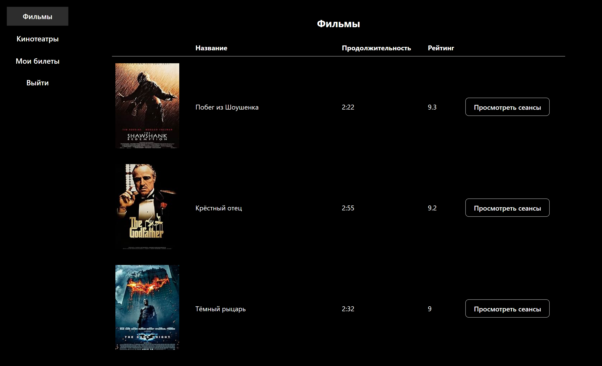

# PRISM Cinema

An online ticket booking system for cinemas built with Vue 3 and TypeScript.

## Preview




## Technologies

- **Vue 3**
- **TypeScript**
- **Pinia**
- **Vue Router**
- **Vite**
- **Axios**

## Architecture (Feature-Sliced Design)

```
src/
├── app/                    # Global application settings
├── pages/                  # Application pages
├── features/               # Business features
│   ├── Ticket/             # Ticket booking
│   └── Schedule/           # Session schedule
│
├── entities/               # Business entities
│   ├── Booking/            # Bookings
│   ├── Cinema/             # Cinemas
│   ├── Movie/              # Movies
│   └── MovieSession        # Movie sessions
│
├── shared/                 # Reusable code
│   ├── types/              # Types
│   ├── ui/                 # UI components
│   └── utils/              # Utilities
│
└── widgets/                # Independent widgets
    ├── Table/              # Tables
```

## Development

```bash
# Install dependencies
yarn install

# Start development server
yarn dev

# Build the project
yarn build

# Run linter
yarn lint

# Run prettier
yarn format
```
